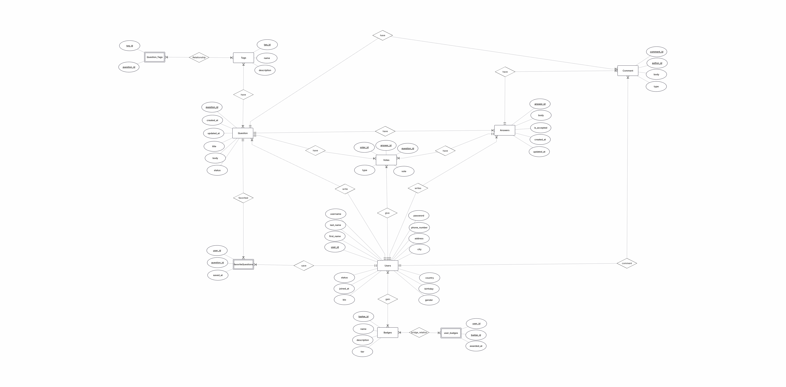

# Q-A-Platform-SQL
Description: Relational DB design for a Q&amp;A platform with constraints, stored procedures, and analytics queries (PostgreSQL).

This is a PostgreSQL database project for a Q&A website (similar to StackOverflow).
It includes the database schema, sample data, functions for common actions, and reporting queries.

## Files in this project

- **DDL.sql**  
  Creates the database structure: tables, relationships (PK/FK), enums, and constraints.

- **DML.sql**  
  Inserts sample data (users, questions, answers, comments, votes, tags, badges).

- **DQL_Data_Operations.sql**  
  Contains SQL / PL/pgSQL functions for operations (example: post a question, post an answer, vote, comment, add tags, bookmark, etc.).

- **DQL_DataReporting.sql**  
  Contains reporting queries (example: most active users, popular tags, most answered questions, activity statistics).

## Tech
- PostgreSQL
- SQL + PL/pgSQL

- ## ERD

